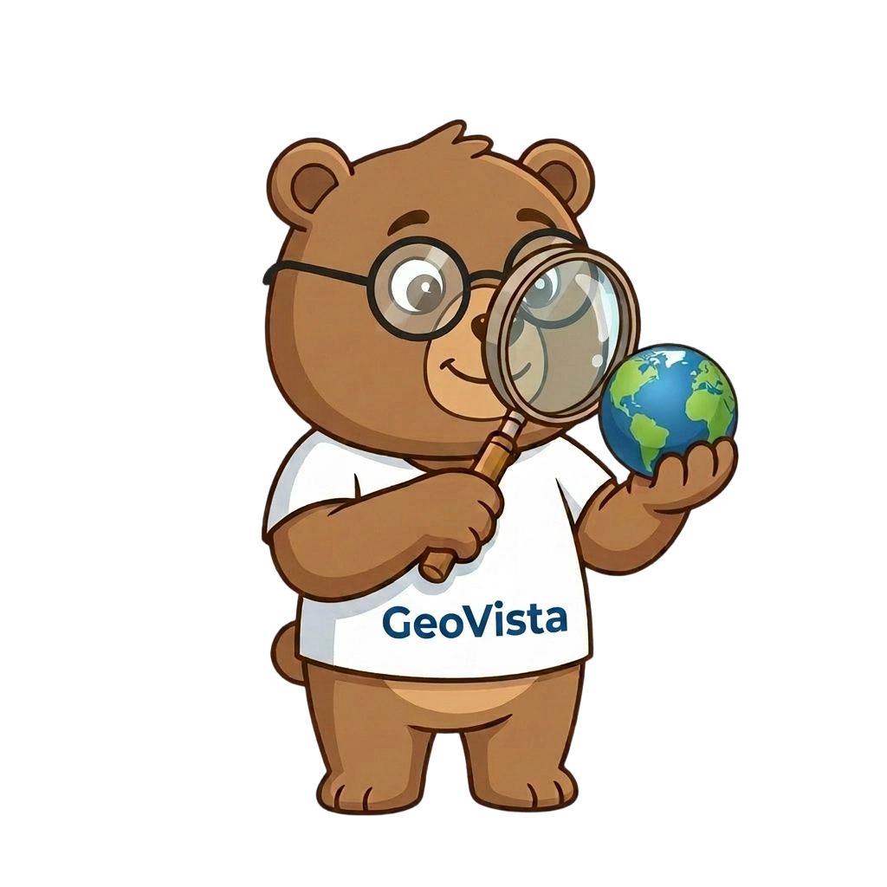
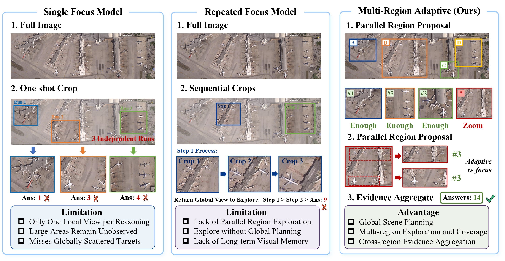

<div align="center">
  <h1>
    
    GeoVista: Visually Grounded Active Perception for Ultra-High-Resolution Remote Sensing Understanding
  </h1>
  
  <br clear="all">
  <br>

  <a href="https://arxiv.org/abs/2605.14475">
    
  </a>
  <a href="https://huggingface.co/datasets/ryan6073/APEX-GRO">
    
  </a>
  <a href="https://www.modelscope.ai/datasets/Ryan_Zhu/APEX-GRO">
    
  </a>
  <!-- <a href="https://huggingface.co/ChenShawn/DeepEyes-7B">
    
  </a> -->
  <a href="https://ryan6073.github.io/GeoVista/">
    
  </a>
</div>

---



## Contents:

1. [Getting Started](#getting-started)
2. [Demo](#demo)
3. [Benchmark](#benchmark)
4. [Evaluation](#evaluation)
5. [Training](#training)
6. [License](#license)
7. [Citation](#citation)
8. [Acknowledgement](#acknowledgement)

## Getting Started 

### Installation

```bash
conda create -n geovista python=3.10 -y
conda activate geovista
# 安装核心依赖 (基于 vLLM, verl 与 LLaMA-Factory)
pip install -r requirements.txt
pip install flash-attn --no-build-isolation
export PYTHONPATH=$PYTHONPATH:path_to_geovista_repo

```

### Pre-trained Models

项目支持加载经过 SFT 或 RL 对齐的模型权重：

* **GeoVista-SFT (Qwen2.5-VL-7B)**: [HuggingFace 链接]
* **GeoVista-RL-GRPO (Qwen2.5-VL-7B)**: [HuggingFace 链接]

### Training Dataset

GeoVista 依赖于专门构建的遥感指令微调数据集：

* **APEX-GRO**: 用于监督微调（SFT）和智能体能力初始化。
* **HighRS / LRS_GRO**: 包含多尺度遥感目标与级联推理标注。

```text
├── data
│   ├── APEX-GRO
│   │   └── images
│   ├── HighRS
│   └── LRS_GRO

```

## Demo 

您可以使用内置的 `GeoVistaAgent` 启动推理任务。框架会自动注册物理执行工具并处理多轮对话逻辑。

```python
from geovista.agent_framework import GeoVistaAgent, zoom_in_tool

# 初始化 Agent
agent = GeoVistaAgent(model_name="qwen2.5-vl-7b", api_base="http://localhost:8011/v1")
# 注册物理级裁剪工具
agent.register_tool("zoom_in", zoom_in_tool)

# 启动任务
agent.run(
    user_prompt="图中共有多少架小型民航客机？请通过局部放大确认。",
    image_path="path/to/uhr_image.tif"
)

```

## Benchmark 

我们的评估基准包含在 `data/benchmark` 目录下，主要涵盖了高分辨率场景下的目标检测、计数与属性识别。格式如下：

```javascript
{
  "target_type": "remote-sensing-object",
  "coordinates": [x_min, y_min, x_max, y_max], // 基于 0-1000 相对坐标系
  "question": "What is the specific type of this aircraft?",
  "ground_truth": "Boeing 737-800"
}

```

## Evaluation 

运行以下脚本评估模型在遥感任务中的推理性能与工具调用准确率：

```bash
# 评估 Agent 调度能力与目标检测精度
python evaluate_agent.py --config training/RL/geovista_grpo.yaml --task count_task

```

## Training 

### 1. 监督微调 (SFT)

利用 APEX-GRO 数据集对模型进行指令微调：

```bash
llamafactory-cli train training/SFT/qwen2_5_vl_agent_sft.yaml

```

### 2. 强化学习对齐 (RL - GRPO)

通过 GRPO 算法进行强化学习微调，系统将根据回答格式、IOU、准确率及推理过程提供多维度奖励：

```bash
python -m verl.trainer.main_ppo --config-path training/RL/geovista_grpo.yaml

```

## License 

本项目采用 **MIT License**。

## Citation 

如果您觉得本项目对您的研究有所帮助，请考虑引用：

```bibtex
@misc{zhu2026geovistavisuallygroundedactive,
      title={GeoVista: Visually Grounded Active Perception for Ultra-High-Resolution Remote Sensing Understanding}, 
      author={Jiashun Zhu and Ronghao Fu and Jiasen Hu and Nachuan Xing and Xu Na and Xiao Yang and Zhiwen Lin and Weipeng Zhang and Lang Sun and Zhiheng Xue and Haoran Liu and Weijie Zhang and Bo Yang},
      year={2026},
      eprint={2605.14475},
      archivePrefix={arXiv},
      primaryClass={cs.CV},
      url={https://arxiv.org/abs/2605.14475}, 
}

```

## Acknowledgement 

* 本项目基于 [vLLM](), [verl]() 以及 [LLaMA-Factory]() 构建。
* 感谢 [Qwen]() 团队提供的强大视觉语言基础模型。

